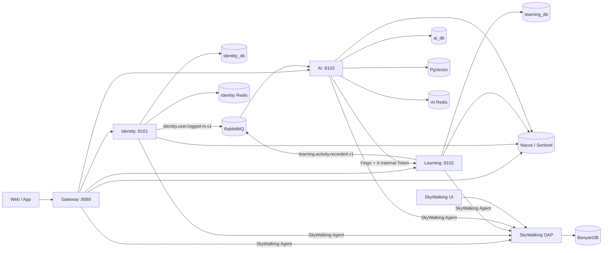

# 架构说明

## 总览

## 服务边界

- Identity 独占 `UserInformation`，签发 access/refresh token，登录后发布事件。
- Learning 独占 `MistakeQuestion`、`knowledgePoint`、`UserData`，OCR 和生成题入库也必须通过它的内部接口。
- AI 独占学习事件向量、洞察、消费幂等记录和 PgVector 文档。它不能查询 learning schema。
- `refine-contracts` 只包含跨进程 DTO 和事件，不共享领域实体或 Mapper。
- Identity Redis 只保存邮箱验证码和 refresh token；AI Redis 只保存会话记忆和生成题缓存。两个实例独立持久化、独立故障，不使用逻辑 database 假装隔离。

## 服务内代码组织

- Gateway 保持 feature-based：`security`、路由和限流组件直接服务于网关职责，不引入空的领域层。
- Identity 以 `account` 为业务模块，使用 `api / application / domain / infrastructure`。账号状态和密码变更等规则放在 domain，Redis、JWT、邮件、MyBatis 和 RabbitMQ 都是 adapter。
- Learning 以 `mistake`、`knowledge`、`overview` 为业务模块。错因、笔记、状态和复习查询都属于 mistake 聚合；复习页面不是独立写模型，避免复制错题数据或绕过聚合。
- AI 按 `conversation`、`solve`、`question`、`ocr`、`suggestion`、`analytics`、`rag` 组织。每种能力的 application 只依赖 port；LangChain4j、Feign、Redis、PgVector、MyBatis 和 RabbitMQ 实现在对应 infrastructure 包中。
- `refine-common` 和 `refine-contracts` 只提供跨服务基础能力与线协议，不承载业务实体或 Mapper。

## 公共路由

| 路径 | 服务 |
|---|---|
| `/api/userAccount/**` | identity |
| `/api/v1/keypoints_explanation/**` | learning |
| `/api/v1/overview/**` | learning |
| `/api/v1/mistake-reason/**` | learning |
| `/api/v1/feedback/review/**` | learning |
| `/api/v1/solve/**` | ai |
| `/api/v1/conversation/**` | ai |
| `/api/v1/ocr/**` | ai |
| `/api/v1/learning-analysis/**` | ai |
| `/api/v1/ai_suggession/**` | ai |
| `/api/question/**` | ai |

内部 `/internal/v1/**` 没有网关路由，并要求恒定时间比较的 `X-Internal-Token`。

## 安全

网关先删除客户端的 `X-User-Id` 和 `X-Internal-Token`。公开路径仅验证码、注册、登录、重置密码、刷新令牌；其余请求验证 HMAC JWT 的签名、过期时间和 `type=access`，再写入可信 `X-User-Id`。401 和 Sentinel 429 使用与业务一致的 `traceId/code/info/data` 响应形状。

## 数据与一致性

每个 MySQL 账号只拥有自己的 schema。`@ReadReplica` 查询走从库，事务和未标记查询走主库；获取从库连接失败时回退主库。新写入后的立即读取不标记 `@ReadReplica`，因此固定走主库。

MySQL 复制采用 GTID、ROW binlog 和异步复制。从库启用 `read_only` 与 `super_read_only`。不提供自动故障转移，避免在没有仲裁和 fencing 的情况下产生双主。

## 消息可靠性

发布者使用同一 `eventId` 等待 Publisher Confirm，最多尝试 3 次。业务提交后最终发布失败会增加 `refine_domain_event_publish_failures_total` 并输出结构化错误，不回滚业务。消费者失败由 Spring AMQP 重试 3 次，之后进入专属 DLQ；`consumed_events.event_id` 与画像写入在同一事务中，重复消息不会重复生成画像。

本设计明确接受“数据库提交成功但消息最终未发布”的窗口。彻底消除该窗口需要 Transactional Outbox，不属于当前版本。

## 可观测性

四个 Java 进程通过 SkyWalking Agent 向 OAP 上报 HTTP、Feign、RabbitMQ、JDBC、Redis、JVM 和自定义业务指标。OAP 将 Trace、拓扑和指标写入独立 BanyanDB，业务数据库不保存观测数据。

日志使用 SkyWalking Logback Toolkit 注入 `traceId`。现有 Micrometer 自定义指标通过 `SkywalkingMeterRegistry` 上报，因此 RabbitMQ 发布最终失败和 RAG 导入结果仍可观测。Agent 或 OAP 不可用时业务服务继续运行。

## RAG

AI 服务的 PgVector 只保存审核教材、教纲和知识点资料的分块、向量、校验值与出处，不保存用户聊天或错题。LangChain4j 按资料元数据递归分块并批量生成远程 Embedding；PgVector HNSW 与 `pg_trgm` 分别提供语义和关键词召回，应用层使用 RRF 融合。检索片段带教材章节引用后才会注入 AI 提示词；资料不足时不伪造来源。相同 SHA-256、模型和维度直接跳过，不存在启动清表逻辑。PgVector 不被其他服务访问。
