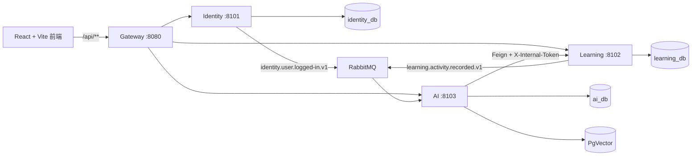

# Refine 项目技术说明与验证指南

这是一份本地联调与技术核对手册。它只描述当前仓库已经实现的能力；不把规划中的能力表述成已上线能力。

## 一句话定位

Refine 是一个面向错题沉淀、知识点复习和 AI 辅助学习的微服务项目：以学习域为核心，使用 Gateway 统一身份边界，使用 LangChain4j 编排远程 AI/OCR/RAG 能力，并通过消息事件形成异步学习画像。

## 本地联调检查

不要在提交中包含 `.env`、邮箱授权码、数据库密码和模型 API Key。

1. 基础设施容器已启动，Nacos、RabbitMQ、Redis、MySQL 主从、PgVector 和 SkyWalking 可访问。
2. Identity、Learning、AI、Gateway 四个 Java 服务均已启动，并已注册到 Nacos。
3. 前端在 `http://localhost:5173` 启动，`VITE_PROXY_URL` 未设置时默认代理到 `http://localhost:8080`。
4. 浏览器打开开发者工具的 Network 面板；确认业务请求走 `/api/**`，而不是直连 `8101`、`8102` 或 `8103`。
5. 可使用 Flyway 的本地示例账号：`demo@refine.local` / `RefineDemo123`。该账号仅用于本地联调。

快速健康检查：

```powershell
8080, 8101, 8102, 8103 | ForEach-Object {
  Invoke-WebRequest "http://localhost:$_/actuator/health" -UseBasicParsing
}
```

若服务无法注册或路由异常，先看 [运行与故障演练](OPERATIONS.md)，确认基础设施、Nacos 注册和 Gateway 路由状态后再排查业务代码。

## 服务关系与数据边界



| 服务 | 持有的数据与职责 | 不做什么 |
|---|---|---|
| Gateway | 路由、JWT、CORS、身份头清洗、Sentinel 限流 | 不保存业务数据，不承载领域规则 |
| Identity | 账号、密码散列、验证码、令牌、登录事件 | 不访问学习或 AI 数据库 |
| Learning | 错题、错因、笔记、知识点、复习、概览 | 不调用模型，也不保存向量 |
| AI | OCR、解题、对话、生成题、学习分析、RAG | 不跨库查询或写入 Learning 表 |

## 技术设计要点

### 安全边界

- Gateway 会先移除客户端提交的 `X-User-Id`、`X-Internal-Token` 和 `X-Gateway-Token`。
- 对受保护请求，Gateway 验证 JWT 的签名、有效期和 access token 类型后，重新写入可信的 `X-User-Id` 与 Gateway 令牌。
- 业务服务由 `GatewayTokenFilter` 拒绝绕过 Gateway 的普通用户请求；`/internal/**` 使用独立的 `X-Internal-Token`，且没有公开路由。

这不是“前端传用户 ID 就算登录”，而是把身份信任边界固定在网关。

### 异步事件的可靠性取舍

- 事件交换机：`refine.domain.events`。
- 登录事件：`identity.user.logged-in.v1`；学习活动事件：`learning.activity.recorded.v1`。
- 发布端使用 Publisher Confirm、有限重试和失败指标；消费者以 `eventId` 去重，失败重试后进入 DLQ。
- 当前版本没有 Outbox，因此数据库已提交而消息最终失败仍有一个明确记录的风险窗口；这是当前版本明确接受的可靠性边界。

### RAG 的知识来源

PgVector 中存放的是经过审核的教材、教辅和知识点资料的分块、向量、来源和校验值，不存用户聊天记录或错题正文。导入使用 SHA-256 幂等键；服务启动不会清空向量表。检索结果带来源后才注入提示词，材料不足时要求模型说明依据不足，而不是伪造引用。

### 可观测性

SkyWalking Agent 覆盖 Gateway、Feign、RabbitMQ、JDBC、Redis 和 JVM 调用；OAP 将追踪和指标写入 BanyanDB，SkyWalking UI 在 `http://localhost:8088` 展示拓扑、慢调用和错误链路。日志携带 `traceId`，可以从请求日志定位整条调用链。

完成一次 OCR 或生成题后，可运行：

```powershell
.\deploy\scripts\verify-skywalking.ps1
```

然后打开 SkyWalking UI，按服务名查看 Gateway → AI / Learning 的调用关系。BanyanDB 是观测数据存储，不是业务数据库，也不需要从业务代码中直接查询。

## 设计决策速查

| 追问 | 回答要点 |
|---|---|
| 为什么 AI 不直接写错题表？ | 数据属于 Learning；通过内部契约保留数据库所有权，避免跨库耦合和隐式联表。 |
| 主从延迟怎么处理？ | 事务、鉴权和写后立即读固定走主库；只有明确标注的只读查询走从库，故障时回退主库。 |
| JWT 被伪造用户头绕过怎么办？ | Gateway 清洗头并验证 JWT；业务服务还校验 Gateway Token，直接携带 `X-User-Id` 请求会被拒绝。 |
| 为什么会话放 Redis？ | 相比 JVM 内存可跨重启、跨实例共享；用命名空间、TTL 和容量策略限制短期记忆的内存占用。 |
| RAG 是否等于把所有数据喂给模型？ | 不是。只检索已审核知识资料的少量相关分块，携带来源并按 SHA-256 幂等导入。 |
| 为什么不用 Prometheus/Grafana？ | 当前项目选 SkyWalking + BanyanDB，重点是端到端 Trace、拓扑和调用错误关联；未同时维护重复的监控链路。 |

## 本地安全与故障验证

### 验证伪造身份头无效

以下请求应返回 `401`，且不会改变任何数据。

```powershell
Invoke-WebRequest http://localhost:8102/api/v1/feedback/review/list `
  -Headers @{ "X-User-Id" = "forged" } -UseBasicParsing

Invoke-WebRequest http://localhost:8103/api/v1/learning-analysis/insights `
  -Headers @{ "X-User-Id" = "forged" } -UseBasicParsing
```

### 验证链路采集

先经 Gateway 完成一次 AI 或 OCR 请求，再运行 `verify-skywalking.ps1`。若脚本提示服务缺失，说明还没有实际产生该服务的 Trace，而不是业务接口必然不可用。

### 主从回退演练

只在本地环境执行。步骤、恢复命令和注意事项见 [运行与故障演练](OPERATIONS.md) 的“从库故障回退”章节；不要在没有停写、追平复制和 fencing 策略的生产环境中自动提升从库。

## 已验证基线与交付前复查

最近一次完整本地验证基线为 Maven 7 个模块、116 个测试通过；前端已通过类型检查、单元测试、Lint 和生产构建。提交前仍应重新运行以下命令，避免把过期结果当成当前结果：

```powershell
# 后端
mvn -f .\pom.xml verify

# 前端
Push-Location ..\frontend
npm run type-check
npm test
npm run lint
npm run build
Pop-Location

# 基础设施与观测
.\deploy\scripts\health-check.ps1
.\deploy\scripts\verify-skywalking.ps1
```

## 参考文档

- [架构说明](ARCHITECTURE.md)
- [运行与故障演练](OPERATIONS.md)
- [AI 与邮件配置](AI_CONFIGURATION.md)
- [RAG 知识库说明](RAG_KNOWLEDGE_BASE.md)
- [已有简历讲解要点](RESUME_TALKING_POINTS.md)

## Referencias

- [[ARCHITECTURE]]
- [[OPERATIONS]]
- [[RAG_KNOWLEDGE_BASE]]
