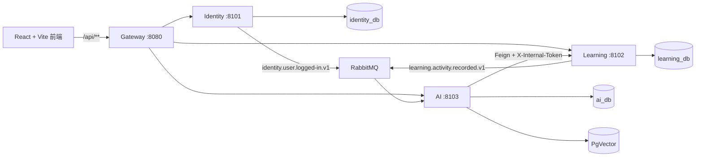

# Refine 项目演示与面试讲解指南

这是一份面向本地演示、答辩和面试的操作手册。它只描述当前仓库已经实现的能力；不把规划中的能力表述成已上线能力。

## 一句话定位

Refine 是一个面向错题沉淀、知识点复习和 AI 辅助学习的微服务项目：以学习域为核心，使用 Gateway 统一身份边界，使用 LangChain4j 编排远程 AI/OCR/RAG 能力，并通过消息事件形成异步学习画像。

## 演示前检查

不要在屏幕共享、录屏或提交中展示 `.env`、邮箱授权码、数据库密码和模型 API Key。

1. 基础设施容器已启动，Nacos、RabbitMQ、Redis、MySQL 主从、PgVector 和 SkyWalking 可访问。
2. Identity、Learning、AI、Gateway 四个 Java 服务均已启动，并已注册到 Nacos。
3. 前端在 `http://localhost:5173` 启动，`VITE_PROXY_URL` 未设置时默认代理到 `http://localhost:8080`。
4. 浏览器打开开发者工具的 Network 面板；确认业务请求走 `/api/**`，而不是直连 `8101`、`8102` 或 `8103`。
5. 演示账号可使用 Flyway 的本地示例账号：`demo@refine.local` / `RefineDemo123`。该账号仅用于本地演示。

快速健康检查：

```powershell
8080, 8101, 8102, 8103 | ForEach-Object {
  Invoke-WebRequest "http://localhost:$_/actuator/health" -UseBasicParsing
}
```

若服务无法注册或路由异常，先看 [运行与故障演练](OPERATIONS.md)，不要在演示现场修改业务代码。

## 三分钟演示脚本

### 1. 登录与首页（30 秒）

在登录页使用本地示例账号登录，进入首页后展示学习概览、复习待办和知识点摘要。

可这样讲：

> 入口只暴露 Gateway。用户登录后，Gateway 校验 access token，再把经过验证的用户标识注入下游。Learning 负责错题、知识点和概览；AI 负责模型调用和学习洞察，所以它们各自只持有自己的数据。

观察 Network：登录是 `POST /api/userAccount/login`；概览是 `GET /api/v1/overview/get_overview`。两类请求都经过 `:8080`，而非浏览器直接访问业务服务。

### 2. 错题与知识点（30 秒）

打开“我的错题”，进入任意错题详情，演示错因选择、学习笔记和刷新后详情仍能恢复。随后进入“知识点库”，展示关联题目和掌握状态。

可这样讲：

> 错题、错因、笔记和复习状态是同一个学习聚合内的规则，放在 Learning 服务，而不是让 AI 服务跨库更新。这样用户数据的一致性边界清晰，后续扩展复习策略也不会产生跨服务事务。

关键接口为 `GET /api/v1/feedback/review/list`、`GET /api/v1/feedback/review/detail`、`POST /api/v1/mistake-reason/toggle/{reasonName}` 和 `/api/v1/keypoints_explanation/**`。

### 3. OCR 上传入库（45 秒）

上传一张包含题目的图片，等待 OCR 识别结果。确认页面显示“已加入错题库”和知识点关联提示，再切回错题库和知识点库验证新增内容实际可见。

可这样讲：

> OCR 本身属于外部模型边界，因此由 AI 服务适配远程 Provider；但错题和知识点的所有权属于 Learning。AI 不跨库写入，而是通过带 `X-Internal-Token` 的内部 Feign 契约请求 Learning 落库。刚写入后的用户查询固定走主库，避免异步主从复制造成“提示成功但列表暂时看不到”的体验问题。

入口是 `POST /api/v1/ocr/extract-first`（multipart）；内部 `/internal/v1/mistakes` 和 `/internal/v1/knowledge-points` 没有 Gateway 路由。

### 4. AI 解题与追问（45 秒）

在 AI 解题页输入题目并提交，展示逐字流式输出。随后在右侧问答区追问题目中的一个条件，确认回答能引用当前题目上下文，而不是要求用户重复粘贴题目。

可这样讲：

> 这部分使用 Spring MVC 的 SSE 输出，前端按事件逐段渲染 Markdown。会话记忆没有放在 JVM 内存，而是使用带命名空间和过期策略的 Redis 适配器，服务重启不会丢失短期对话；题目上下文由应用用例显式注入，避免模型不知道正在讨论哪道题。

入口为 `POST /api/v1/solve/stream`、`POST /api/v1/conversation/send-message` 和 `POST /api/v1/conversation/solve-with-context`。响应类型为 `text/event-stream`；发生流式错误时会发送 `event: error`，而不是把半截文本伪装成成功结果。

### 5. 举一反三与判题（30 秒）

从错题详情进入“举一反三”，生成练习题并提交答案，展示判题的流式反馈与错题记录。

可这样讲：

> 生成题前 AI 会通过内部契约获取该错题的生成上下文和近期知识点；生成和判题属于 AI 应用编排，学习记录仍回到 Learning 的数据边界。这样既避免共享 Mapper，也避免为了一个流程引入分布式事务。

关键入口是 `POST /api/question/generation`、`POST /api/question/judge`（SSE）和 `POST /api/question/record`。

## 服务关系与数据边界



| 服务 | 持有的数据与职责 | 不做什么 |
|---|---|---|
| Gateway | 路由、JWT、CORS、身份头清洗、Sentinel 限流 | 不保存业务数据，不承载领域规则 |
| Identity | 账号、密码散列、验证码、令牌、登录事件 | 不访问学习或 AI 数据库 |
| Learning | 错题、错因、笔记、知识点、复习、概览 | 不调用模型，也不保存向量 |
| AI | OCR、解题、对话、生成题、学习分析、RAG | 不跨库查询或写入 Learning 表 |

## 可视化与可追问的技术亮点

### 安全边界

- Gateway 会先移除客户端提交的 `X-User-Id`、`X-Internal-Token` 和 `X-Gateway-Token`。
- 对受保护请求，Gateway 验证 JWT 的签名、有效期和 access token 类型后，重新写入可信的 `X-User-Id` 与 Gateway 令牌。
- 业务服务由 `GatewayTokenFilter` 拒绝绕过 Gateway 的普通用户请求；`/internal/**` 使用独立的 `X-Internal-Token`，且没有公开路由。

这不是“前端传用户 ID 就算登录”，而是把身份信任边界固定在网关。

### 异步事件的可靠性取舍

- 事件交换机：`refine.domain.events`。
- 登录事件：`identity.user.logged-in.v1`；学习活动事件：`learning.activity.recorded.v1`。
- 发布端使用 Publisher Confirm、有限重试和失败指标；消费者以 `eventId` 去重，失败重试后进入 DLQ。
- 当前版本没有 Outbox，因此数据库已提交而消息最终失败仍有一个明确记录的风险窗口；这是刻意接受并在面试中应主动说明的边界。

### RAG 的知识来源

PgVector 中存放的是经过审核的教材、教辅和知识点资料的分块、向量、来源和校验值，不存用户聊天记录或错题正文。导入使用 SHA-256 幂等键；服务启动不会清空向量表。检索结果带来源后才注入提示词，材料不足时要求模型说明依据不足，而不是伪造引用。

### 可观测性

SkyWalking Agent 覆盖 Gateway、Feign、RabbitMQ、JDBC、Redis 和 JVM 调用；OAP 将追踪和指标写入 BanyanDB，SkyWalking UI 在 `http://localhost:8088` 展示拓扑、慢调用和错误链路。日志携带 `traceId`，可以从请求日志定位整条调用链。

演示时可先完成一次 OCR 或生成题，再运行：

```powershell
.\deploy\scripts\verify-skywalking.ps1
```

然后打开 SkyWalking UI，按服务名查看 Gateway → AI / Learning 的调用关系。BanyanDB 是观测数据存储，不是业务数据库，也不需要从业务代码中直接查询。

## 五分钟面试讲解

### 开场（40 秒）

> 我把原有学习系统以并行工程的方式拆成 Gateway、Identity、Learning 和 AI 四个运行单元。拆分依据不是 Controller 数量，而是数据所有权和一致性边界：账号归 Identity，错题和知识点归 Learning，模型会话、向量和洞察归 AI。

### 核心路径（90 秒）

> 用户上传题目时，Gateway 统一鉴权；AI 调 OCR Provider 识别；AI 通过版本化内部契约请求 Learning 创建错题和知识点，不直接写 Learning 的 MySQL。用户随即查询错题时走主库，避免异步复制延迟导致刚写入的数据不可见。AI 解题和判题走 SSE，前端支持 Markdown 和错误事件。

### 稳定性与治理（90 秒）

> 服务发现和配置使用 Nacos；Gateway 和关键 AI/Feign 调用使用 Sentinel 限流与快速降级；RabbitMQ 的事件发布有 Confirm 和有限重试，消费者用 eventId 幂等并有 DLQ。为了可排查问题，SkyWalking 把 HTTP、Feign、JDBC、Redis、RabbitMQ 串成一条 Trace。

### 取舍（60 秒）

> 我没有为了形式完整引入 Saga、事件溯源、通用 Repository 或 Outbox。错题域使用 DDD-lite 保留聚合规则；AI 采用应用编排和 ports/adapters；Gateway 保持 feature-based。当前直接发布消息的可靠性边界已记录；若登录画像成为强一致业务，下一步才会引入 Outbox + CDC。

## 常见追问与回答要点

| 追问 | 回答要点 |
|---|---|
| 为什么 AI 不直接写错题表？ | 数据属于 Learning；通过内部契约保留数据库所有权，避免跨库耦合和隐式联表。 |
| 主从延迟怎么处理？ | 事务、鉴权和写后立即读固定走主库；只有明确标注的只读查询走从库，故障时回退主库。 |
| JWT 被伪造用户头绕过怎么办？ | Gateway 清洗头并验证 JWT；业务服务还校验 Gateway Token，直接携带 `X-User-Id` 请求会被拒绝。 |
| 为什么会话放 Redis？ | 相比 JVM 内存可跨重启、跨实例共享；用命名空间、TTL 和容量策略限制短期记忆的内存占用。 |
| RAG 是否等于把所有数据喂给模型？ | 不是。只检索已审核知识资料的少量相关分块，携带来源并按 SHA-256 幂等导入。 |
| 为什么不用 Prometheus/Grafana？ | 当前项目选 SkyWalking + BanyanDB，重点是端到端 Trace、拓扑和调用错误关联；未同时维护重复的监控链路。 |

## 故障演示（可选，不要在主流程第一轮做）

### 验证伪造身份头无效

以下请求应返回 `401`。演示结束后无需改变任何数据。

```powershell
Invoke-WebRequest http://localhost:8102/api/v1/feedback/review/list `
  -Headers @{ "X-User-Id" = "forged" } -UseBasicParsing

Invoke-WebRequest http://localhost:8103/api/v1/learning-analysis/insights `
  -Headers @{ "X-User-Id" = "forged" } -UseBasicParsing
```

### 验证链路采集

先经 Gateway 完成一次 AI 或 OCR 请求，再运行 `verify-skywalking.ps1`。若脚本提示服务缺失，说明还没有实际产生该服务的 Trace，而不是业务接口必然不可用。

### 主从回退演练

只在本地演示环境执行。步骤、恢复命令和注意事项见 [运行与故障演练](OPERATIONS.md) 的“从库故障回退”章节；不要在没有停写、追平复制和 fencing 策略的生产环境中自动提升从库。

## 已验证基线与交付前复查

最近一次完整本地验证基线为 Maven 7 个模块、116 个测试通过；前端已通过类型检查、单元测试、Lint 和生产构建。交付或录屏前仍应重新运行以下命令，避免把过期结果当成当前结果：

```powershell
# 后端
mvn -f .\pom.xml verify

# 前端
Push-Location ..\refine-frontend
npm run type-check
npm test
npm run lint
npm run build
Pop-Location

# 基础设施与观测
.\deploy\scripts\health-check.ps1
.\deploy\scripts\verify-skywalking.ps1
```

录屏建议顺序：登录 → 概览 → OCR 入库 → 错题/知识点确认 → AI 解题与追问 → 生成题/判题 → SkyWalking 拓扑。这样既能展示用户价值，也能自然带出微服务边界、流式 AI、异步事件与可观测性。

## 参考文档

- [架构说明](ARCHITECTURE.md)
- [运行与故障演练](OPERATIONS.md)
- [AI 与邮件配置](AI_CONFIGURATION.md)
- [RAG 知识库说明](RAG_KNOWLEDGE_BASE.md)
- [已有简历讲解要点](RESUME_TALKING_POINTS.md)

## Referencias

- [[ARCHITECTURE]]
- [[OPERATIONS]]
- [[RAG_KNOWLEDGE_BASE]]
